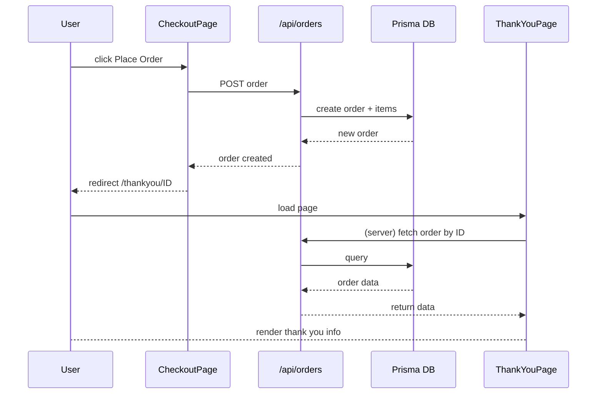

# ecom-sample-site Project Documentation

This document is intended as a comprehensive guide for any developer joining the `ecom-sample-site` repository. It covers the architecture, entry points, API design, authentication, database schema, code structure, and runtime flow. Diagrams using Mermaid are included; you can render them in editors that support Mermaid or export as PDF via Markdown-to-PDF tools.

---

## 📁 Directory Structure

```
app/               # Next.js app router and page components
  (root)/          # root namespace with layouts and pages
    checkout/      # checkout page and related props
    thankyou/      # pages for thank-you flow with dynamic order id
  api/             # serverless route handlers (GET/POST etc.)\ncomponents/        # reusable UI components and subfolders
hooks/             # custom React hooks
lib/               # utility functions and config
prisma/            # database schema, seed data, repository helpers
public/            # static assets (images, icons, etc.)
service/           # client-side fetch wrappers around API/external services
store/             # Zustand stores for client state
types/             # TypeScript type definitions
generated/         # Prisma client output
middleware.ts      # global middleware for auth & headers

package.json, tsconfig.json, etc. (project configuration)
```

Every major feature is a combination of a page under `app/`, design components under `components/`, logic helpers under `service/`, and a corresponding API endpoint under `app/api/`.

---

## 🔑 Authentication & Sessions

Authentication is implemented with NextAuth (credential provider) plus Iron Session for additional server-side sessions.

- **NextAuth provider** located at `app/api/auth/[...nextauth]/route.ts`.
  - Uses PostgreSQL via Prisma for user lookup (`userRepo.findUserByEmailWithPass`).
  - JWT strategy; session and jwt callbacks propagate `id`, `name`, `role`.
  - Custom sign-in page: `/login`.

- **Iron Session**: After successful NextAuth sign-in, the `/api/login` POST route copies the NextAuth session into an Iron Session cookie for accessing user data in non-NextAuth APIs.

- **Middleware** (`middleware.ts`) protects all `/api` endpoints except some public ones. It checks:
  1. Non‑authenticated GETs for a whitelist of public paths (`EXCLUDED_PATHS` such as `/api/categories`, `/api/product`, etc.) are allowed if the request contains valid `x-site-origin` and `x-client-key` headers matching environment variables.
  2. All other requests require a cookie named `authjs.session-token` (or `next-auth.session-token`). If missing, a 401 JSON response is returned.

```mermaid
flowchart LR
    A[Browser] -->|fetch /api/orders| B(Middleware)
    B -- has cookie? --> C{yes}
    B -- no cookie & not public --> D[401 Unauthorized]
    B -- no cookie & public headers valid --> E[NextResponse.next()]
    C --> E
```

- **Header bypass** is used in many `service/*` wrappers when calling server‑side endpoints (`API_CONFIG.ALLOWED_ORIGIN`, `API_CONFIG.CLIENT_KEY`).

---

## 🛠 API Routes

Routes live under `app/api/*`. Handlers export HTTP methods (GET/POST/PUT/DELETE). They use `NextRequest`/`NextResponse`.

Examples:

- `app/api/orders/route.ts` – create & list orders, calls `prisma/repository/orderRepo`.
- `app/api/product/[id]/route.ts` – fetch a product by ID.
- `app/api/discounts/route.ts` & `[id]/route.ts` – manage discount codes.
- `app/api/auth/[...nextauth]/route.ts` – NextAuth handlers.

Every route typically:
1. Parses `req.json()` or `req.nextUrl.searchParams`.
2. Performs input validation.
3. Calls repository functions (`prisma/repository/*`) which use Prisma Client to access the database.
4. Returns `NextResponse.json({ ... }, { status: XX })`.

> **Tip**: new APIs should be added here; services in `service/` wrap them for frontend consumption.

---

## 🧩 Service Layer (Client Fetch Wrappers)

`service/` contains utility functions used by React components (in pages or components) to talk to either:

- The same Next.js API routes under `/api/*`, or
- External/internal backend (`siteBaseApiUrl`) using header authentication.

Examples:

```ts
// service/orders.service.ts
export async function createNewOrderApi(data) {
  return fetch(siteBaseApiUrl + siteApiConfig.orders.baseApi, { method: "POST", ... });
}
```

Almost all wrappers are `async` and return typed results or `null` on failure. They also log responses for debugging.

---

## 🗄 Database Schema (Prisma)

Schema defined in `prisma/schema.prisma`. Key models:

- `User` – authentication data, with `role` relation.
- `Product`, `Category`, `Section` – core e-commerce catalog.
- `Order` & `OrderItem` – capture purchases; `Order` links to `Discount`.
- `Discount` – codes with value, period, and relations.
- `Address` – delivery addresses.
- `Role`, `Permission` – basic RBAC.
- `ApiKey`, `ApiLog` – for header-based public routes.

Refer to the schema file for complete field definitions and enums (`OrderStatus`, `DiscountType`, etc.).

---

## 🧠 Code Flow Example: Checkout → Place Order → Thank You

1. **CheckoutPage** (`app/(root)/checkout/CheckoutPage.tsx`)
   - Uses `useCartStore` to retrieve cart items and discount.
   - Validates auth via `useSession`; redirects to login if missing.
   - Loads addresses via `fetchAllAddressesByUserId` service.
   - `handlePlaceOrder` (wrapped in `useCallback`) sends order data to `createNewOrderApi`.
   - Upon success, clears cart & discount store and redirects to thank‑you page.

2. **API call** → `/api/orders` POST route creates an order using `orderRepo.createNewOrder`.
3. **Thank You Page** (`app/(root)/thankyou/[order]/page.tsx` server component)
   - Fetches order server‑side via `fetchOrderByIdApi` (calls external API with headers).
   - Renders `ThankYouPage` client component with order data.
   - `ThankYouPage` checks Iron Session in `useEffect` and redirects to login if needed.



---

## 🔧 Code Structure & Patterns

- **React components** are mostly functional, using hooks (`useState`, `useEffect`, `useCallback`), and typed with TypeScript.
- **Zustand stores** in `store/` manage client state (cart, session, preferences).
- **Repository layer** (`prisma/repository/*`) isolates direct Prisma calls.
  - e.g., `productRepo.getById`, `orderRepo.createNewOrder`.
- **Utilities** in `lib/` for authentication (`auth.ts`), imageKit integration, discount calculations, etc.
- **Types** under `types/` unify data interfaces used throughout the frontend.

### Example repo function (orderRepo)

```ts
export async function createNewOrder(data: OrderRequest) {
  return prisma.order.create({
    data: {
      userId: data.userId,
      paymentTotal: data.paymentTotal,
      orderItems: { create: data.cartItems.map(...) }
    }
  });
}
```

### Session handling

- `lib/ironSession.ts` contains helpers to get/set iron-session cookies.
- Middleware reads cookies; components use `useSession` (NextAuth) or `getIronSessionDecodedCookie()`.

---

## 🗂 Entry Points Summary

| Entry Point | Purpose | Client/Server | Auth? |
|-------------|---------|---------------|-------|
| `app/page.tsx` | Home page layout | Client | No |
| `app/(root)/checkout/page.tsx` | Checkout UI | Client | Requires login |
| `app/api/*` | API handlers | Server | Middleware protects |
| `app/api/auth/[...nextauth]` | NextAuth auth | Server | Public |
| `middleware.ts` | Global request guard | Server | Applies to `/api` |

---

## 📝 Development & Setup

1. **Environment**
   - Copy `.env.example` to `.env` with `DATABASE_URL`, NextAuth secrets, etc.
2. **Install**
   ```bash
   npm install  # or yarn
   npx prisma migrate dev --name init
   npm run dev
   ```
3. **Generate Prisma client** is automatic on migration.
4. **Seed data** via `prisma/seed.ts` (run `npm run seed` if script exists).
5. **Lint & format**: project uses ESLint/Prettier presets via `eslint.config.mjs`.

---

## 📦 Exporting Documentation

To convert this Markdown into a PDF, use a tool such as:

```bash
autochecker markdown-pdf PROJECT_DOCUMENTATION.md
# or
pandoc PROJECT_DOCUMENTATION.md -o docs.pdf
```

Alternatively, open the file in VS Code and use the "Markdown: Export (PDF)" command from the command palette.

---

By following this guide, any developer should be able to navigate the codebase, understand the core flows, add new features, and maintain existing functionality. Happy coding! 🎉
